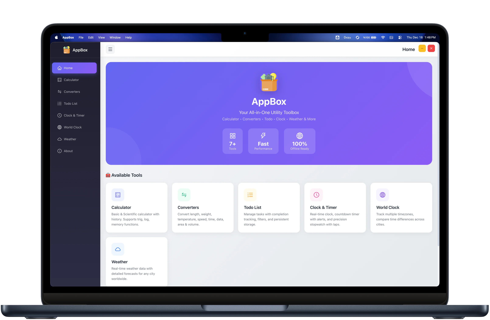
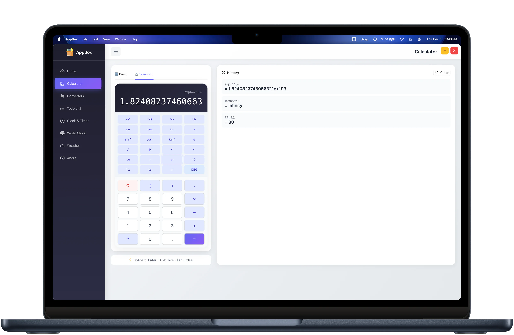
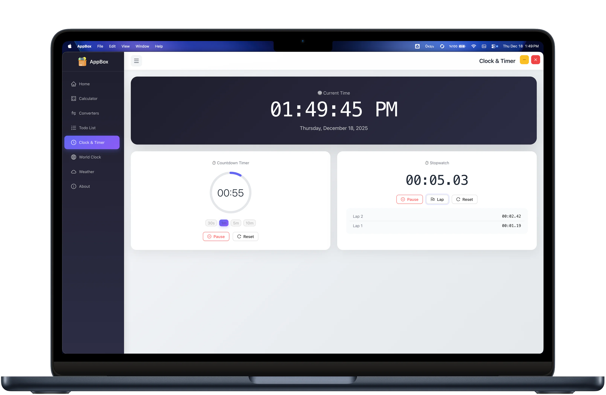
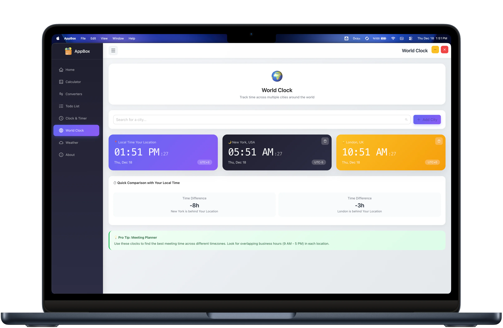
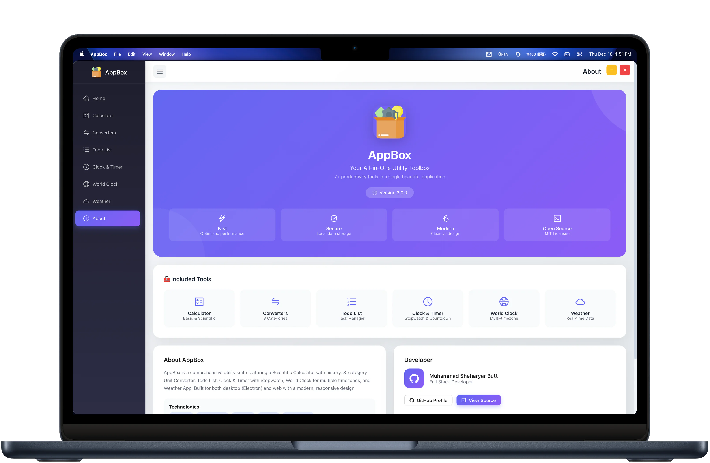

<div align="center">
  <a href="https://choosealicense.com/licenses/mit/">
    
  </a>
  <a href="https://github.com/shehari007/mini-react-electron-desktop-app">
    
  </a>
</div>

<br />

<div align="center">
  
</div>

# AppBox — All‑in‑One Utility Toolbox (React + Electron)

AppBox is a modern, responsive utility suite built with **React**, **Ant Design**, and **Electron**. It bundles multiple everyday tools into a single app that runs as a desktop application (Windows/macOS/Linux) and can also be deployed as a web build.

Demo (web preview): https://appbox.msyb.dev/

## Highlights

- **Full-width, responsive UI** across pages and components
- **Local persistence** via `localStorage` (todos, calculator history, weather settings, world clock cities)
- **Keyboard-friendly calculator** (Enter to evaluate, Esc to clear)
- **Cross‑platform packaging** via `electron-builder` (Windows NSIS, macOS DMG, Linux DEB)

## Features

- **Calculator**
  - Basic + Scientific modes
  - History panel (last entries)
  - Keyboard input support

- **Converters**
  - Multiple categories (length, weight, temperature, speed, time, storage, area, volume)
  - Swap units and instant conversion

- **Todo List**
  - Add, complete, delete
  - Filters: all / active / completed
  - Clear done / clear all
  - Persists your tasks locally

- **Clock & Timer**
  - Digital clock
  - Countdown timer
  - Stopwatch

- **World Clock**
  - Add/remove cities
  - Local time + multi‑timezone overview
  - Persists selected cities locally

- **Weather**
  - City search + detailed weather panel
  - Persisted settings (API key + default city)

## Screenshots

<div align="center">
  
  <p align="center"><em>Home</em></p>

  
  <p align="center"><em>Calculator With History</em></p>

  
  <p align="center"><em>Converters Utility</em></p>

  
  <p align="center"><em>Clock & Timer</em></p>

  
  <p align="center"><em>World Clock</em></p>

  
  <p align="center"><em>About</em></p>
</div>

## Tech Stack

- **UI:** React 19, Ant Design 6, @ant-design/icons
- **Desktop:** Electron
- **Math:** mathjs
- **Build tooling:** react-scripts, electron-builder
- **Performance metrics:** web-vitals

## Requirements

- Node.js (LTS recommended)
- npm
- (Optional) OpenWeatherMap API key for Weather

## Getting Started

Clone the repo:

```bash
git clone https://github.com/shehari007/mini-react-electron-desktop-app.git
cd mini-react-electron-desktop-app
```

Install dependencies:

```bash
npm install
```

### Run as a web app (development)

```bash
npm start
```

### Run as a desktop app (Electron)

```bash
npm run electron:start
```

This starts the React dev server and opens Electron in desktop window mode.

## Configuration

### Weather API key (optional)

The Weather tool uses **OpenWeatherMap**:

- Create a free API key: https://openweathermap.org/api
- In the app, open **Weather → Settings**
- Add your **API Key** and (optionally) a **Default City**

Settings are stored locally in `localStorage`.

## Scripts

- `npm start` — React dev server (web)
- `npm run build` — Production web build
- `npm test` — Run tests
- `npm run electron:start` — Run Electron + React dev server
- `npm run electron:package:win` — Package Windows (NSIS)
- `npm run electron:package:mac` — Package macOS (DMG)
- `npm run electron:package:linux` — Package Linux (DEB)

## Packaging / Deployment

### Web build

```bash
npm run build
```

Serve locally:

```bash
npm install -g serve
serve -s build
```

### Desktop installers

```bash
# Windows
npm run electron:package:win

# macOS
npm run electron:package:mac

# Linux
npm run electron:package:linux
```

## Security note (Electron)

This project uses Electron settings that are convenient for development and local apps (Node integration / CSP allowing inline scripts). If you plan to ship this broadly, consider hardening Electron security (enable `contextIsolation`, use `preload.js`, and avoid `unsafe-inline`).

## License

MIT — see https://choosealicense.com/licenses/mit/

## Feedback / Contact

- Email: shehariyar@gmail.com
- GitHub: https://github.com/shehari007

If you find this project useful, starring the repo helps a lot.

## Support

Buy me a coffee: https://www.buymeacoffee.com/shehari007
