<div align="center">
  

  <h1>AppBox</h1>

  <p>36 fast, private utilities in one app.<br />
  A static site that deploys anywhere, and a native desktop app from the same codebase.</p>

  <p>
    <a href="https://choosealicense.com/licenses/mit/"></a>
    
    
    
    
  </p>

  <p><a href="https://appbox.msyb.dev">appbox.msyb.dev</a></p>
</div>

---

## What it is

Most single-purpose online tools are the same shape: two inputs, one number out, and
several megabytes of ads around them. AppBox is the opposite trade — one app, no ads,
no analytics, no account, and every calculation runs on your device.

That constraint is what makes the offline story real rather than marketing. 34 of the
36 tools never touch the network, because there is nothing they need a server for. The
two that do — weather and currency — use free, key-less APIs and cache their last result,
so they still show you something useful on a train.

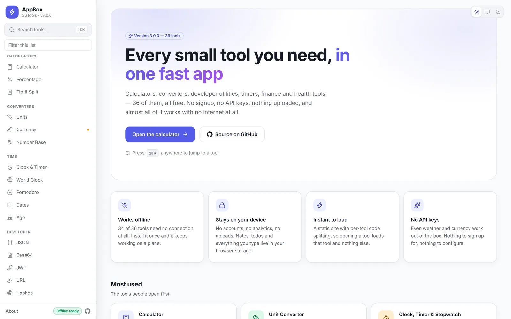

## Screenshots

Every tool picks up its category's colour from a single attribute, so the app stays
varied without becoming noisy. Light and dark are both first-class.

<table>
  <tr>
    <td width="50%">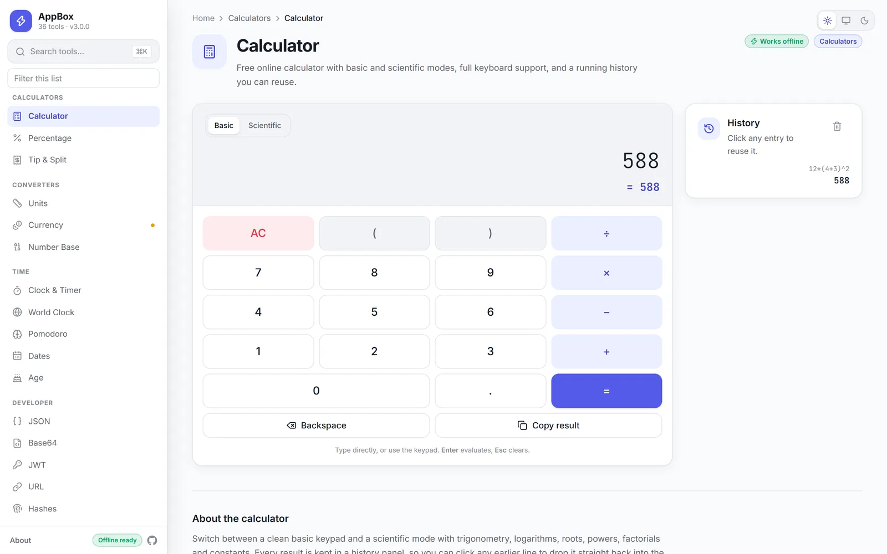<br /><em>Calculator — basic and scientific, with reusable history</em></td>
    <td width="50%">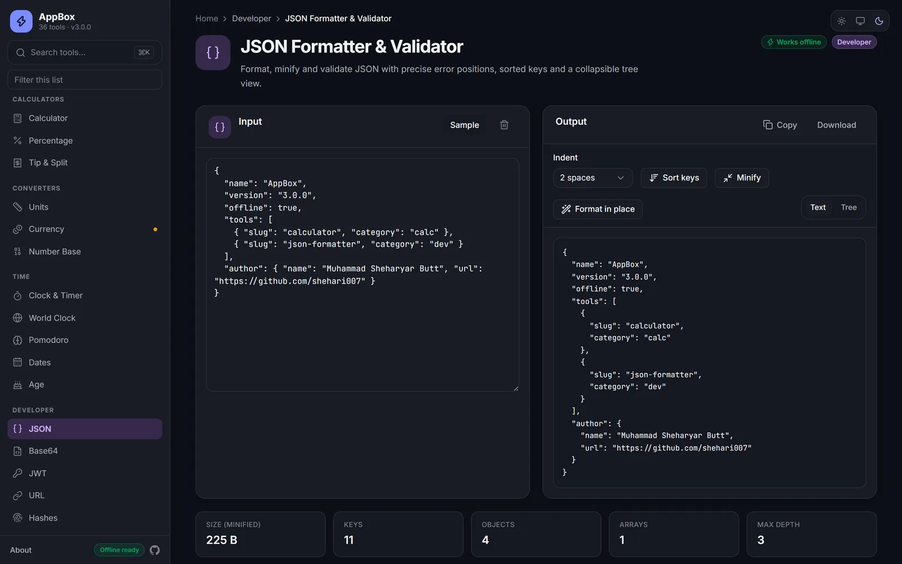<br /><em>JSON formatter — validate, sort keys, tree view</em></td>
  </tr>
  <tr>
    <td>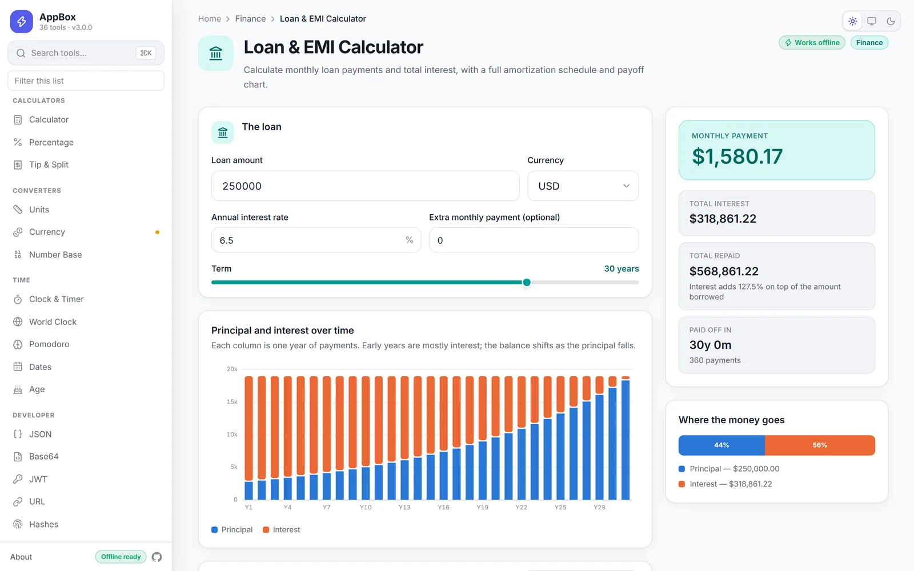<br /><em>Loan calculator — amortization chart and full schedule</em></td>
    <td>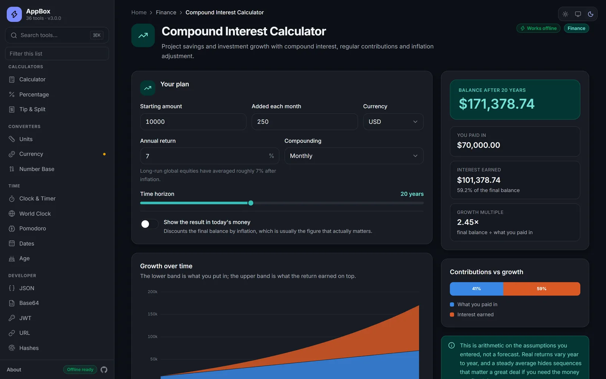<br /><em>Compound interest — contributions versus growth</em></td>
  </tr>
  <tr>
    <td>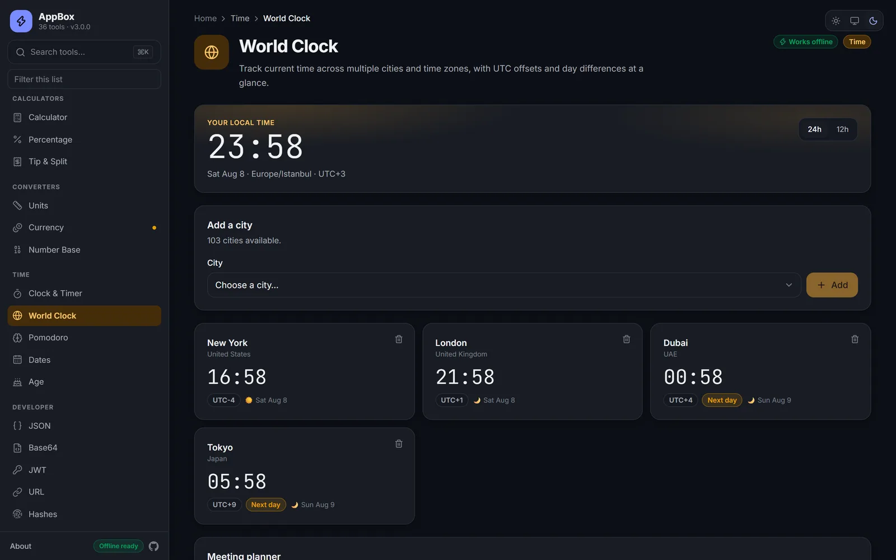<br /><em>World clock — time zones and a meeting planner</em></td>
    <td>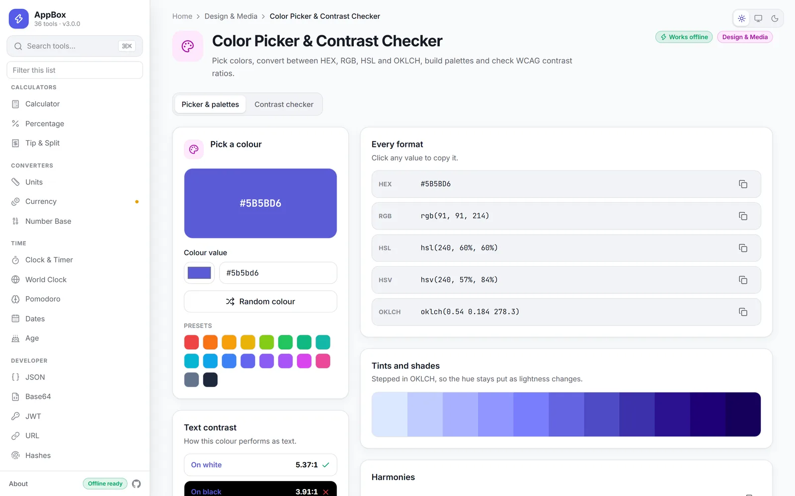<br /><em>Colour tools — formats, palettes, WCAG contrast</em></td>
  </tr>
  <tr>
    <td>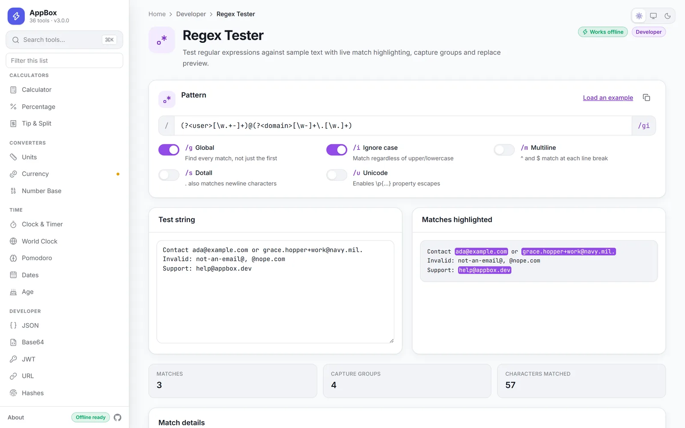<br /><em>Regex tester — live highlighting and capture groups</em></td>
    <td>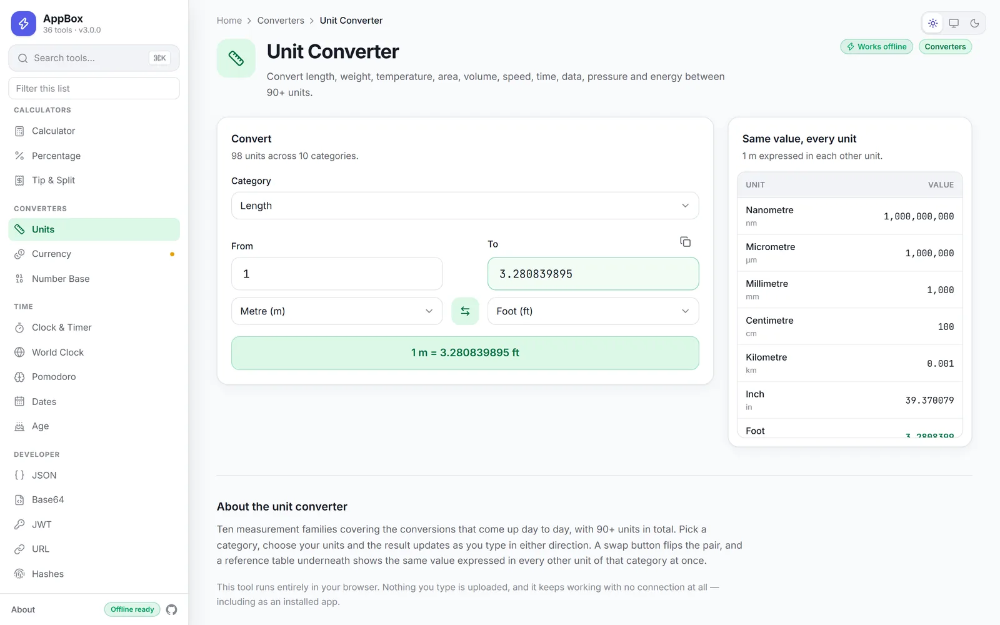<br /><em>Unit converter — 90+ units, both directions</em></td>
  </tr>
  <tr>
    <td>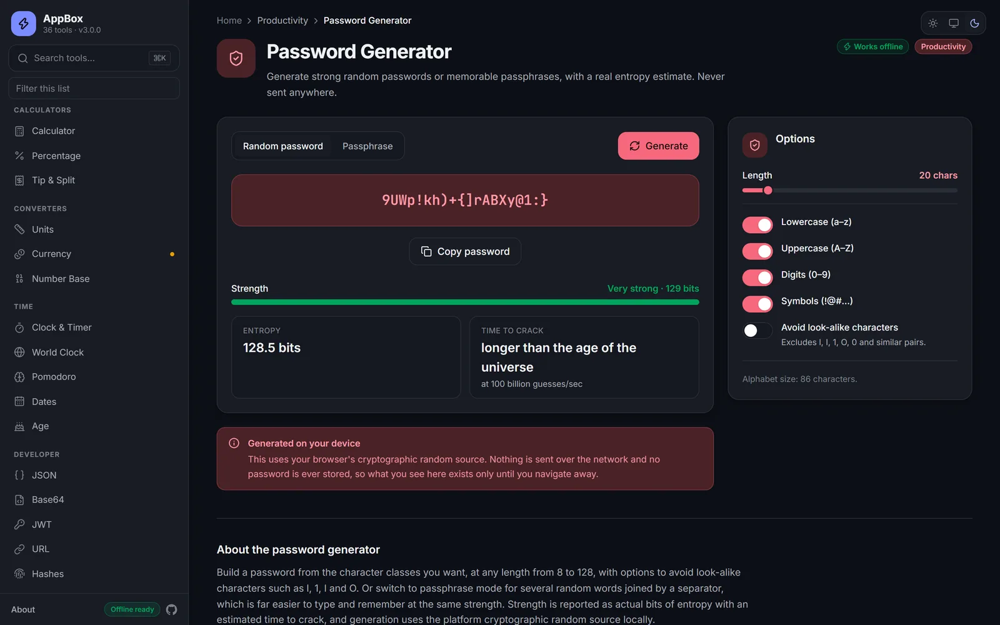<br /><em>Password generator — real entropy, not a vague meter</em></td>
    <td>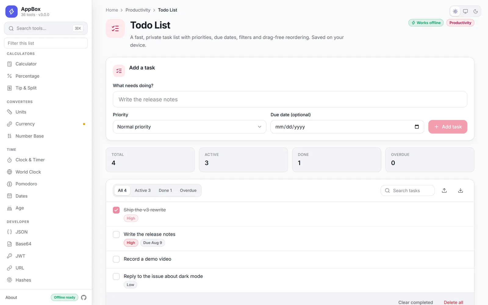<br /><em>Todo list — priorities, due dates, saved locally</em></td>
  </tr>
</table>

Press <kbd>⌘K</kbd> (or <kbd>Ctrl</kbd>+<kbd>K</kbd>) anywhere to jump between tools:

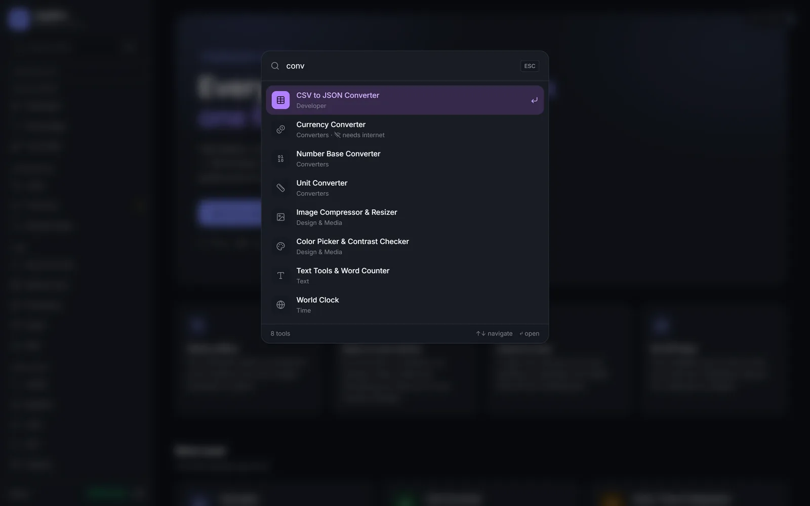

It works properly on a phone too:

<table>
  <tr>
    <td width="50%" align="center">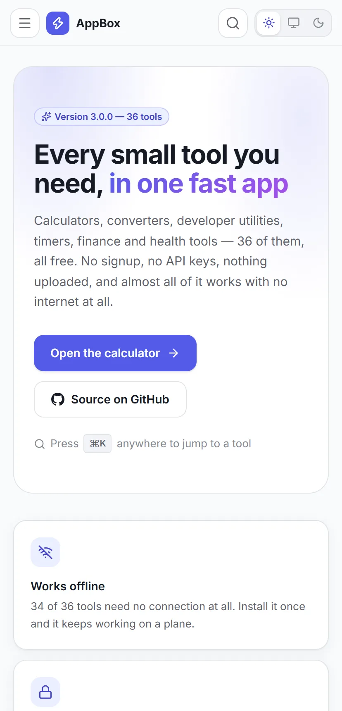</td>
    <td width="50%" align="center">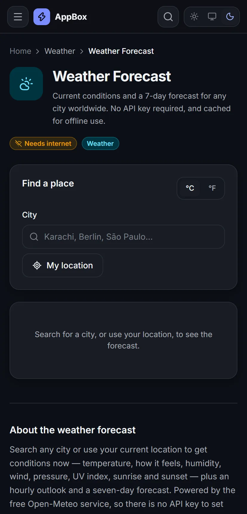</td>
  </tr>
</table>

## The tools

| Category | Tools |
| --- | --- |
| Calculators | Calculator (basic + scientific), Percentage, Tip & bill split |
| Converters | Unit converter (90+ units), Currency, Number base |
| Time | Clock/timer/stopwatch, World clock, Pomodoro, Date calculator, Age calculator |
| Developer | JSON formatter, Base64, JWT decoder, URL encoder, Hash generator, UUID generator, Regex tester, Diff checker, CSV ⇄ JSON, Cron parser |
| Text | Text tools & word counter, Markdown preview, Lorem ipsum |
| Productivity | Todo list, Notes, Password generator, QR codes |
| Design & media | Colour picker & contrast checker, Image compressor |
| Finance | Loan/EMI calculator, Compound interest |
| Health | BMI, Calories & macros, Water intake |
| Weather | 7-day forecast |

## Architecture

One UI codebase serves two targets:

```text
src/                       Next.js 16 App Router — the renderer
├─ app/
│  ├─ layout.tsx           metadata, fonts, theme, service worker
│  ├─ page.tsx             home (server component — no JS needed to read it)
│  ├─ <slug>/page.tsx      one route per tool, 8 lines each
│  ├─ sitemap.ts           generated from the tool registry
│  └─ globals.css          Tailwind v4 tokens, light + dark
├─ components/
│  ├─ tools/               one component per tool
│  ├─ ui/                  buttons, fields, tables, modals, toasts
│  ├─ charts/              hand-rolled inline SVG charts
│  └─ layout/              shell, sidebar, title bar, command palette
├─ lib/                    domain logic, framework-free and unit-testable
│  ├─ tools.ts             THE REGISTRY — single source of truth
│  ├─ expression.ts        arithmetic evaluator (replaces mathjs)
│  ├─ finance.ts  units.ts  colors.ts  cron.ts  diff.ts  csv.ts  hash.ts  …
└─ types/
   └─ appbox-bridge.ts     the IPC contract, shared by preload and renderer

electron/                  compiled by Vite → dist-electron/
├─ main.ts                 window, app:// protocol, IPC, hardening
├─ preload.ts              the only bridge into the renderer
└─ menu.ts                 native menu, generated from the registry

out/                       next build → Vercel  AND  → Electron over app://
```

### The registry is the single source of truth

`src/lib/tools.ts` holds every tool's slug, name, description, category, keywords and
icon. The sidebar, home grid, command palette, native desktop menu, `sitemap.xml`, the
PWA shortcuts and each route's title, meta description and JSON-LD all read from it.
Adding a tool means one registry entry plus one 8-line route file — nothing else to
remember to update.

### Why Next.js and Vite together

They do different jobs. Next.js `output: 'export'` produces real HTML per route, which
is what gives each tool its own title, description, canonical URL and structured data —
the thing the previous version, a single client-rendered page, could not have. Vite
compiles the Electron main and preload processes from TypeScript; it never touches the UI.

### Desktop security

The renderer is sandboxed with `contextIsolation: true`, `nodeIntegration: false` and
`sandbox: true`. It reaches the host only through the narrow, typed surface in
`electron/preload.ts`. The packaged app is served from a registered `app://` scheme rather
than `file://`, which gives it a stable origin so `localStorage`, `history.pushState` and
`fetch` behave exactly as they do on the web.

## Getting started

```bash
git clone https://github.com/shehari007/mini-react-electron-desktop-app.git
cd mini-react-electron-desktop-app
npm install
```

### Run it

```bash
npm run dev              # web, at http://localhost:3000
npm run electron:dev     # desktop, with hot reload
npm run electron:preview # desktop, against a production build
```

### Check it

```bash
npm run typecheck        # tsc --noEmit, strict
npm run lint             # eslint
npm run build            # static export into out/
```

### Package the desktop app

```bash
npm run package:win      # NSIS installer (x64 + arm64)
npm run package:mac      # DMG (x64 + arm64)
npm run package:linux    # AppImage + .deb
```

Installers land in `release/`.

## Deploying the web build

The repo is ready for Vercel with no configuration — `vercel.json` sets the build command,
output directory, cache headers and a Content-Security-Policy matching the desktop one.

Any static host works too: `npm run build`, then serve `out/`.

```bash
npx serve out
```

Set `NEXT_PUBLIC_SITE_URL` if you deploy to a different domain, so canonical URLs and the
sitemap point at the right place.

## Offline behaviour

| | Web | Desktop |
| --- | --- | --- |
| 34 offline tools | Service worker caches all 36 routes after one visit | Files are on disk |
| Weather, Currency | Cached result, with its age shown | Same |
| Saved data | `localStorage`, on your device | Same |
| Fonts | Self-hosted by `next/font` — no request to Google | Same |

## Privacy

There is no analytics script, no cookie banner and no third-party embed on any page.
Todos, notes, history, saved cities and preferences are written to your browser's local
storage and never leave the device. The only outbound requests the app ever makes are the
weather and currency lookups, and only when you open those tools. `/about` has an export
button and a clear-everything button for the data it holds.

## Notable implementation choices

- No charting library. The four chart forms the app needs are ~500 lines of inline SVG in
  `components/charts/`. Recharts would have added ~100KB to routes whose selling point is
  loading instantly. Chart colours are a fixed, colourblind-validated 3-slot palette,
  deliberately independent of the per-tool accent so a series colour always means the
  same thing.
- No `mathjs`. `lib/expression.ts` is a tokeniser plus shunting-yard evaluator with
  degree/radian trig, postfix factorial and implicit multiplication — a few hundred lines
  instead of a 500KB dependency, and it returns errors specific enough to show the user.
- MD5 is hand-written. Web Crypto deliberately excludes it, and verifying a download
  against a published checksum is exactly the legacy case people still need it for. It is
  fuzz-checked against `node:crypto` across 139 inputs.
- Rendered Markdown is sanitised. `marked` passes raw HTML through, so both the Markdown
  tool and Notes run output through DOMPurify before it reaches the DOM.
- Per-tool accent colours. Each category sets one `data-accent` attribute and everything
  inside inherits that palette through CSS custom properties, so tool components never
  reference a colour directly. This needs `@theme inline` in Tailwind v4 — a plain
  `@theme` freezes the substitution at `:root` and every tool renders the same colour.

## Contributing

Issues and pull requests are welcome. To add a tool:

1. Add an entry to `TOOLS` in `src/lib/tools.ts`.
2. Create `src/components/tools/YourTool.tsx`.
3. Create `src/app/your-slug/page.tsx` (copy any existing one — they are identical bar two names).

Navigation, search, the desktop menu, the sitemap and metadata all pick it up automatically.

## Author

Built and maintained by Muhammad Sheharyar Butt.

- GitHub: [@shehari007](https://github.com/shehari007)
- Email: [shehariyar@gmail.com](mailto:shehariyar@gmail.com)
- Support: [Buy me a coffee](https://www.buymeacoffee.com/shehari007)

## License

MIT — see [LICENSE](LICENSE).
